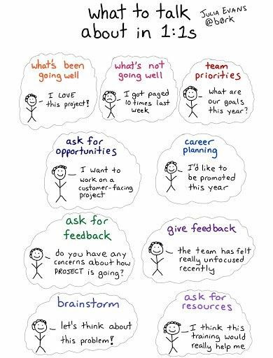
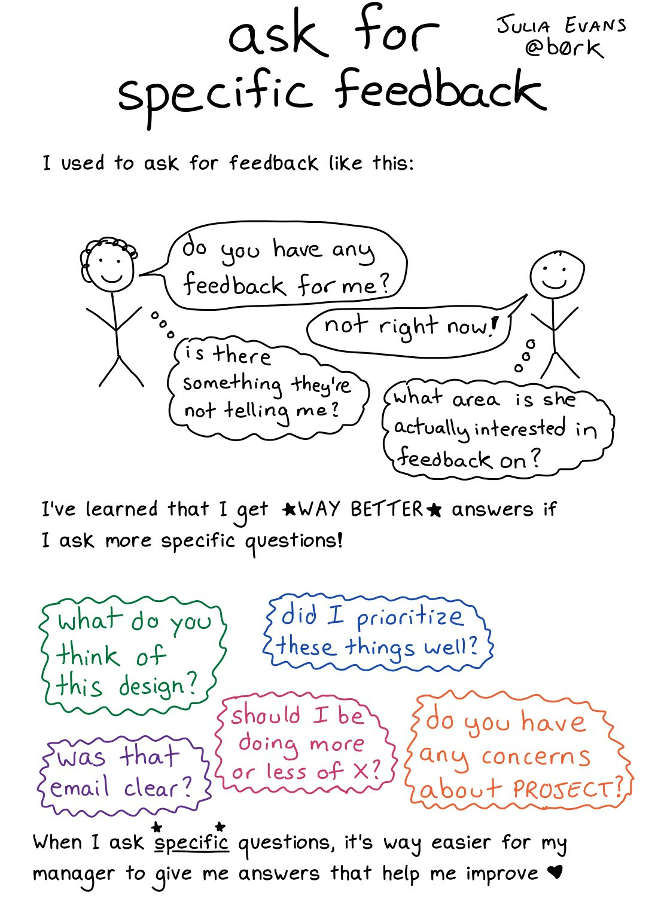

********************
Interview Process
********************

*Some useful links to cover the Interview process*

##############################
Telephonic | Skype Interview
##############################
- https://www.thebalance.com/what-to-do-if-your-phone-interviewer-doesn-t-call-2062794

- https://workplace.stackexchange.com/questions/40233/does-the-company-call-me-in-a-skype-interview-or-should-i-call-them

- https://workplace.stackexchange.com/questions/78192/company-asks-for-a-scanned-copy-of-my-passport

- https://www.jobvite.com/candidate-engagement/11-red-flags-to-watch-for-during-an-interview

###########################
Questions as a Candidate
###########################
- https://www.themuse.com/advice/51-interview-questions-you-should-be-asking
   
- https://relocateme.eu/blog/how-to-successfully-pass-an-interview-at-a-software-product-company
   
- https://dev.to/ice_lenor/do-i-want-to-work-in-this-company-or-what-questions-to-ask-on-an-interview-7po
   
- https://www.thebalance.com/why-do-you-want-to-work-here-2061292 
   
- http://firstround.com/review/the-best-interview-questions-weve-ever-published/

- https://medium.freecodecamp.org/why-you-should-ask-questions-at-your-next-tech-company-interview-5070384dc5a0

- https://hackernoon.com/what-to-ask-an-interviewer-during-a-tech-interview-865a293e548c
   
- https://resources.workable.com/tutorial/faq-recruiting-emails

- http://questionsforinterviewer.com/questions-to-ask-interviewer

- https://kostasbariotis.com/interviewer-vs-interviewee

- https://jvns.ca/blog/compensation-questions

###########################
Take-Home Challenges
###########################
- https://www.fullstackinterviewing.com/2018/02/02/the-ultimate-guide-to-kicking-ass-on-take-home-coding-challenges.html

- https://www.themuse.com/advice/heres-what-the-hiring-managers-actually-looking-for-in-that-dreaded-takehome-assignment

- https://workplace.stackexchange.com/questions/6166/what-is-the-etiquette-for-a-take-home-code-test

- https://workplace.stackexchange.com/questions/61478/a-programming-task-is-scaring-off-candidates-should-we-ditch-it

- https://angel.co/blog/engineers-hate-your-take-home-project-heres-how-to-fix-it

###########################
Technical Career Growth
###########################
- https://jvns.ca/blog/2018/09/30/some-possible-career-goals

- https://jvns.ca/blog/senior-engineer

- https://blog.usejournal.com/the-software-engineering-job-ladder-4bf70b4c24f3

- https://medium.com/javascript-scene/software-roles-and-titles-e3f0b69c410c

- https://medium.com/s/story/notes-to-myself-on-software-engineering-c890f16f4e4d

- https://github.com/kamranahmedse/developer-roadmap

- https://blog.alicegoldfuss.com/how-to-get-into-sre

Doing 1-on-1
#################

	

Employee Manager Feedback
###########################
